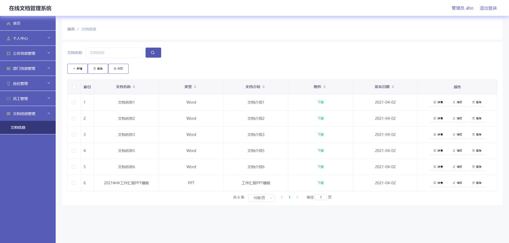

# 基于Springboot的在线文档管理系统

## Springboot-0026


## 技术栈

Springboot mybatisplus vue mysql maven


## 数据库表(8张)


## 功能介绍

```properties
管理员：
首页、个人中心、公告信息管理、部门信息管理、岗位管理、员工管理、文档信息管理；

员工；
首页、个人中心、公告信息管理、文档信息管理等功能。
```


## 图片

### 前台

### 后台




## 访问路径

### 前台

```properties

```

### 后台

```properties
http://localhost:8080/springbootpkh49/admin/dist/index.html#/login

账号 abo
密码 abo
```


## 功能图


## 文档目录


## 打赏或交流


